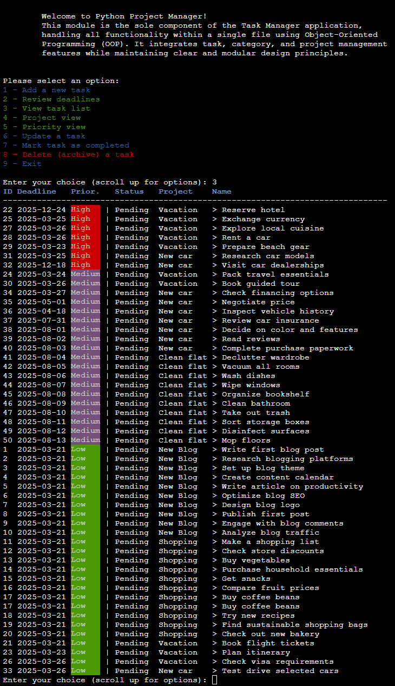
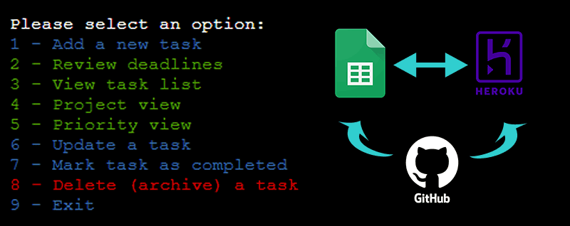
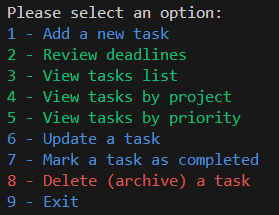
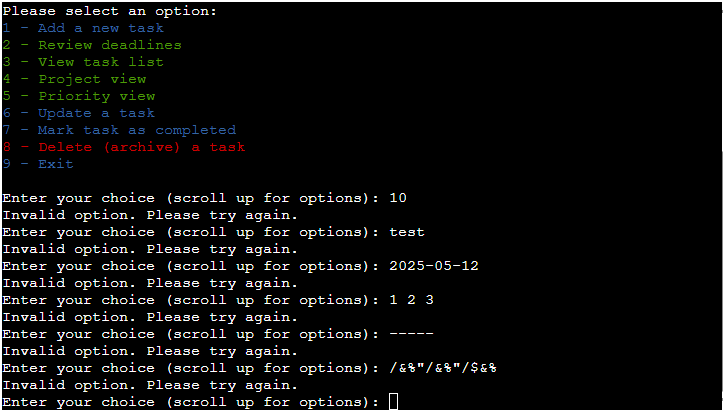
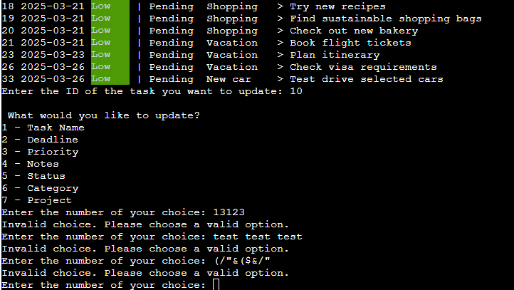
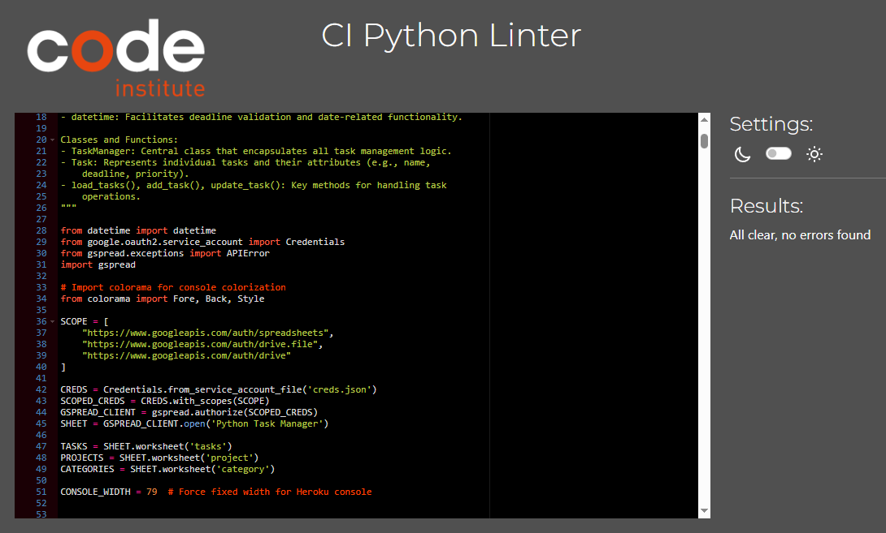

# Task Management Console

Welcome to the `Task Manager`, a Python command-line application designed to create, organize, and manage tasks effectively. This project interacts with Google Sheets to store and process data, making it both powerful and dynamic. The last update to this file was: `April 15, 2025.`

## Table of Contents

* Project Description 
* Key Features & Benefits
* Technologies Used
  * (Built with…)
* Project Requirements and Dependencies
* Installation Instructions
* Usage Instructions
* Testing
* Common problems and bugs
* Acknowledgments
* License

## Project Description

This repository contains Python code of a console-based project, focusing on task management facilitating data storage in Google Sheets in real time. Whyle interacting with a Python backend, the application allows users to manage tasks by adding, updating, deleting as well as marking tasks as done/pending and changing deadlines, priority and corresponding projects.

## Key Features

### Features

* **Task Creation and Management:** Users can create, organize, and manage tasks.
* **Data Persistence:** Google Sheets integration provides a dynamic and accessible data storage solution. Tasks, categories, and projects are synchronized with a Google Sheets spreadsheet.
* **Web Interface:** JavaScript-based frontend for user interaction.
* **Backend Processing:** Python backend handles data manipulation and interaction with external services.
* **Real-time updates:** The use of Google Sheets API provides real-time updates of the application.
* **Colorized Console Output:**
  * Visually enhanced task lists with color-coded priorities and headers for better readability:
    * _High Priority_: Red background
    * _Medium Priority_: Pink background
    * _Low Priority_: Green background
    * _Empty Priority_: Gray background
    * Underlined headers
* **Caching for Improved Performance:**
  * Google Sheets data is loaded and cached locally in memory to optimize performance and reduce API calls, ensuring smooth operation even under quota restrictions.

## Technologies Used

* **Node.js:** JavaScript runtime environment. (https://nodejs.org/).
* **Python 3.x:** Python runtime environment. (https://www.python.org/downloads/).
* **pip:** Python package installer (usually included with Python).
* **Git:** Version control system (https://git-scm.com/downloads).
* **google-auth library:** the Google authentication library for Python. (https://google-auth.readthedocs.io/en/latest/).
* **gspread** a Python API for Google Sheets. (https://docs.gspread.org/en/v6.1.3/).

You'll also need to install the necessary Python packages listed in requirements.txt.

## Project Requirements and Dependencies

* **GitHub repository:** a pubic repository that hosts the program code
* **Heroku account:** the program requires active Hroku account connected to the program's GitHub repository as well as heroku/python and heroku/nodejs Buildpacks activated in the Heroku settings.
* **Google Sheets:** the project relies on a user's Google account with an existing Google Sheet formated in specific way (see below). The Google Sheet used by the program has to be shared in a way that allows to connect it with Heroku app via Heroku Config vars.
* **Colorama:** Colorama ANSI escape character sequences needed for adding colors to the console

## Deployment

* **1. Clone the Repository**
  * Use CodeInstiute repository (https://github.com/Code-Institute-Org/ci-full-template)
  * Make sure your main script file is named run.py.
* **2. Set Up Google API Credentials**
  * Create a Google Cloud project and enable the Google Sheets API and Google Drive API.
  * Create a service account and generate a creds.json file containing the credentials.
  * Place the creds.json file in the root directory of the project.
* **3. Set Up Your Heroku Environment:**
  * Create a new Heroku app.
  * Go to the _Settings_ tab of your Heroku app.
  * Add the following buildpacks in this order:
    * `heroku/python`
    * `heroku/nodejs`
  * Add a Config Var called `PORT` and set it to `8000`.
  * If you use Google Sheets credentials, add another _Config Var_ called `CREDS` and paste the `JSON` credentials into the value field.
  * Include a requirements.txt file listing all your dependencies.
  * Under the Deploy tab in Heroku, connect your _GitHub_ repository.
  * Select the branch you want to deploy (usually main).
  * Click on `Deploy Branch` in the _Heroku_ dashboard.
  * Once deployed, your application can be accessed here.
* **4. Test Your Application:**
  * Make sure all features are functional in the deployed environment.
  * Verify your integration with Google Sheets works as intended.

## Scope of classes & functions 

- **"Task" Class:** Represents an individual task, including attributes like **deadline, priority, status, and notes**.
- **"TaskManager" Class:** Handles task operations such as **loading, caching, validation, and synchronization** with Google Sheets.
- **Google Sheets API:** Enables the program to **fetch, store, and update** task-related data seamlessly.
- **Task Operations:** `add_task()`, `update_task()`, `delete_task()`, `mark_task_completed()`
- **Data Management:** `load_tasks()`, `load_and_cache_data()`, `generate_unique_task_id()`
- **Validation Methods:** Ensure proper **task name, deadline, priority, and category/project selection**.
- **Console Display:** Tasks can be viewed in an **organized table format**, sorted by **priority, deadline, or status**.

### Caching Google Sheets Data

To improve performance and reduce API quota consumption, the application now caches data from the **tasks**, **categories**, and **projects** worksheets during initialization. Cached data is stored in memory and reused throughout the application, minimizing redundant API calls.

**Implementation**

* Data is fetched and cached at the start using the load_and_cache_data() method within the TaskManager class.
* Cached attributes:
  * self.cached_tasks
  * self.cached_projects
  * self.cached_categories
* All operations (e.g., adding, updating, or retrieving tasks, projects, and categories) access these cached attributes instead of making direct calls to the Google Sheets API.

### Colorized Console Output

The application uses the colorama library to add color to text and improve readability in the terminal. Priority levels and headers are visually distinguished by colors.

**Color Coding**

* **Priority**:
  * _High_: Red background
  * _Medium_: Pink background
  * _Low_: Green background
  * _Empty Priority_: Gray background
* **Headers**: Underlined and displayed in blue for clarity.

**Technical Details**

* Colorized output is achieved using the colorama library:
  * _Fore_: Sets text colors (e.g., white for task names).
  * _Back_: Highlights text with background colors for priorities.
  * _Style_: Applies formatting like bold or underlined headers.

## Reminders

* Code Placement: Your code should reside in the `run.py` file.
* Dependencies: Include all required dependencies in the `requirements.txt` file.
* Google Sheets API Setup: Configure the connection to Google Sheets by adding the necessary credentials in your environment variables.
* Data Validation: Built-in validation ensures accurate and clean data input.

## Testing

To ensure the Task Manager application works seamlessly, it's essential to validate its functionality through rigorous testing. Below is an outline of testing practices for various features and a note on input validation:

### 1. Testing Core Features

* **Task Creation**: Test adding new tasks with valid and invalid data (e.g., empty task names, deadlines in the past).
* **Task Updates**: Check all updatable fields (e.g., name, deadline, priority, notes) for correct behavior.
* **Task Deletion**: Verify that deleting tasks updates the status and reflects in cached data and Google Sheets.
* **View Tasks**: Confirm that the displayed tasks match the sorted and filtered criteria.

### 2. Google Sheets Integration

* Validate the synchronization of task data between the application and Google Sheets.
* Test for API error handling, such as retry logic when network issues occur.

### 3. Input Validation

The application has built-in input validation methods to ensure data integrity:

* **Task Names**: Must be non-empty and under 50 characters.
* **Deadlines**: Enforced to follow the format YYYY-MM-DD and must not be in the past.
* **Priority Levels**: Restrict inputs to "High," "Medium," or "Low."
* **Project and Category IDs**: Ensure the selected IDs exist in the respective Google Sheets.

When testing, check these validation methods by deliberately entering invalid inputs to ensure the system provides appropriate error messages and does not proceed with invalid data.

### 4. Console-Based User Interface

* Test for usability in various console environments (e.g., local terminal, Heroku shell).
* Verify that table-based outputs adapt properly to the predefined CONSOLE_WIDTH.

### 5. Error Handling

* Simulate errors like invalid task IDs or failed Google Sheets updates to test how the application handles exceptions gracefully.

### 6. PEP8 validation

* **PEP8 Python Linter test** check the code with Code Institute's Python Linter to make sure that there are no errors or warings
* **Line limit** was kept to 79 characters in order to comply with The Python standard library.

## Using the Task Manager

The Task Manager application allows users to manage tasks, projects, and categories seamlessly while interacting with data stored in Google Sheets. Here's how to navigate and use the system effectively:

### Main Menu

Upon launching the application, you will see a main menu with several options. Each option corresponds to a specific task management operation. Simply enter the number of the desired option to proceed.

### Key Features

1. View Tasks:
    * Displays a list of all tasks in a table format.
    * Tasks are color-coded by priority for better readability:
      * High Priority: Red background
      * Medium Priority: Pink background
      * Low Priority: Green background
      * Empty Priority: Gray background
    * Headers are underlined for clarity.

2. Add a Task:
    * Create a new task with details like name, deadline, priority, status, category, and project.
    * Newly added tasks are stored in Google Sheets and immediately cached for optimized performance.

3. Update a Task:
    * Modify existing tasks by editing attributes such as name, deadline, priority, status, notes, category, and project.
    * Updates are reflected in both the Google Sheets and the cached data.

4. Delete a Task:
    * Remove tasks permanently or archive them to the "deleted" tab in Google Sheets.

5. View Tasks by Filters:
    * Filter and display tasks by priority, category, or project.
    * Color-coded output makes identifying tasks effortless.

6. Caching for Speed:
    * Upon starting the application, Google Sheets data is cached to reduce API calls and improve performance.
    * Cached data includes tasks, projects, and categories, making repeated operations faster.

7. Enhanced Console Output:
    * Headers, tasks, and priorities are formatted with colors and underlining for a visually appealing and user-friendly experience.

### How to Navigate

1. Select an Option:
    * Enter the number corresponding to the desired operation from the menu.
    * Follow the prompts to enter the required information (e.g., task details or filter criteria).

2. Color Indicators:
    * Watch for colored text or backgrounds to quickly identify priorities:
    * Example: High-priority tasks will have a bold red background.

3. Validation:
    * The program will validate inputs like category and project IDs to ensure accuracy.
    * Invalid inputs are flagged with error messages.

4. Real-Time Google Sheets Sync:
    * All changes are immediately synchronized with the Google Sheets file, ensuring your data is always up-to-date.

## Project Constraints

The command-line interface is set to 80 columns by 24 rows. Ensure all outputs stay within these constraints for better readability.

## Requirements

To run this project, you’ll need:

* Python 3.8 or higher
* Required libraries (install using `pip install -r requirements.txt`)
* Google Sheets credentials for API integration
* **colorama Library**: Install the `colorama` library using:
  * bash:
  * `pip install colorama`

## Credits & Acknowledgments

This application relies on following web services and external libraries:

* **ci-full-template** was used for this application (https://github.com/Code-Institute-Org/ci-full-template). Thank you Code Institute!
* **Heroku** is used as a testing environment
* **Google Sheets** is used as a ervice for storing the application data
* **google.oauth2.service_account** used for Google Sheets authentication
* **gspread.exceptions** used for handling Google Sheets API errors
* **Datetime** library is used for handling date and time-related data
* **Colorama** used for better styling of the terminal UI

Many thanks to Rory Patrick Sheridan (https://github.com/Ri-Dearg) for his help with project developemen and validation!

**Happy Task managing!**

We hope this task manager helps simplify your workflow and improves productivity.
